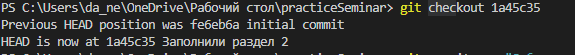

 
# Инструкция по Git 
## 1. Проверка наличия установленного GIT
В терминале выполняем команду __*git --version*__. Если GIT установлен, появится информация о версии GITa.

## 2.Настройка GIT.

При первом использовании GIT надо представиться. Для этого в терминале вводим команды:

__git config --global user.email "Ваша почта"__

**git config --global user.name "Ваше имя"**
# Инструкция для работы с Git и удалёнными репозиториями

## Что такое Git?
Git - это одна из реализаций распределённых систем контроля версий, имеющая как и локальные, так и удалённые репозитории. Является самой популярной реализацией систем контроля версий в мире. 
 ## 3.Инициализация репозитория
Для создание репозитория необходимо выполнить команду __*git init*__ в папке с репозиторием и у Вас создаться репозиторий (появится скрытая папка .git)

## 4.Создание коммитов

### Git add
Для отслеживания файлов и добавления измений в коммит используется команда __*git add*__. Чтобы использовать команду __*git add*__ напишите __*git add <имя файла>*__. Если ввести __*"git add ."*__, то отслеживаться будут все файлы в папке.

### Просмотр состояния репозитория
 Для того, чтобы посмотреть состояние репозитория используется команда __*git status*__. Для этого необходимо в папке с репозиторием написать __*git status*__, и Вы увидите были ли измения в файлах, или их не было.

### Создание коммитов
 Для того, чтобы создать коммит(сохранение) необходимо выполнить команду __*git commit*__. Выполняется она так: напишите __*git commit -m"в кавычках напишите сообщение, которое будет отображаться в журнале изменений"__.

 Команды commit и add можно совмещать, выглядит это так: __*git commit -am "message"*__.

## 5.Git checkout
Чтобы привести программу к выбранной версии, напишите __*git checkout (первые 4 символа названия версии)*__
Команда __*git checkout master*__ приводит программу к самой актуальной версии

## 6.Git diff
Чтобы вывести в терминал изменения в сохранённом файле, напишите __*git diff*__. Удалённые элемнты обозначаются знаком "-", добавленные знаком "+".

## 7. Git log
Выводит в терминал журнал изменений и коммиты, к которым они привязаны. Записывается __*git log*__

## 8. Добавление картинок и игнорирование файлов
Чтобы добавить изображение, нужно:
1. добавить файл с изображением в папку проги(?)*(в имени файла не должно быть пробелов и "-")*.
2. создать файл **.gitignore**. Это нужно для возможности игнора файлов.
3. через **git add** начать отслеживать эти файлы.
4. в файле **.gitignore** написать название файла.(формат). Если файлов одного типа много, можно писать не названия, а **.(формат)**, тогда все файлы такого формата будут игнорироваться(при этом можно не добавлять картинку через git add, достаточно её наличия в папке).
5. В строке, в которую желаем добавить изображение пишем **")"**.
## 9. Ветвление
1. Чтобы отслеживать какие ветки существуют в проге, и на какой мы находимся _(такие отмечены "*")_, вводим команду **git branch**

2. Чтобы создать ветку вводим **git branch (имя ветки _без пробелов_)**
3. Перемещение между ветками происходит через команду *checkout*, выглядит это так: **git checkout (имя ветки)**

4. Чтобы удалить ветку вводим **git branch -d (имя ветки)

5. Если ввести **git log --graph**, можно вывести журнал в более удобном для отображения веток фомате(схема).

6. Ветки можно сливать, см. раздел 10.
## 10. Слияние веток
 Чтобы слить 2 ветки, нужно ввести **git merge (имя ветки)**. *Важно, содержание ветки, имя которой мы вводим добавляется к ветке, на которой мы находимся, не наоборот*

После завершения слияния нужно сделать коммит, если сразу же нужно выполнить следующее слияние, иначе будет ошибка.

 Изменения в текущей ветке можно отслеживать в **Source Control**(ctrl+shift+G). Изменения показаны от момента создания до первого коммита, и от текущего коммита до текущего момента(после написания коммита вкладка с изменениями пропадает)

 

Если содержания строк не пересекаются, слияние проходит, но если информация разнится на одних и тех же строках - возникает конфликт. См. раздел 11
## 11. Решение конфликтов при слиянии веток
При воозникновении конфликта можно увидеть следующее:

1. *HEAD (Current Change)* - показывает содержание конфликтных срок на ветке, на которой мы находимся.
2. *(имя ветки) (Incoming Change)* - показывает содержание конфликтных срок на ветке, которую мы присоединяем.
Над этим находится строка с опциями:
1. *Accept Current Change* - оставляет в конфликтных строках содержание HEAD (Current Change).
2. *Accept Incoming change* - оставляет в конфликтных строках содержание (имя ветки) (Incoming Change).
3. *Accept Both Changes* - оставляет в конфликтных строках содержание обоих ветвей(в порядке сначала Current change, потом Incoming Change).
4. *Compare Changes* - пользователь сам выбирает, что оставить.
Выбрав одну из опций пользователь завершает слияние.
## 12. Удалённые репозитории
Репозитории можно не только создавать на своём пк, но и копировать из GitHub *(далее GH)* Для того, чтобы пользоваться таким способом, нужно знать эти команды:
* git clone <url-адрес репозитория> – клонирование внешнего репозитория на
локальный ПК
* git pull – получение изменений и слияние с локальной версией
* git push – отправляет локальную версию репозитория на внешний репозиторий. Для выполнения команды требуется авторизация.

### Делаем fork репозитория
1. Делаем clone СВОЕЙ версии репозитория(fork)

2. Создаем новую ветку и в ТОЛЬКО В НЕЕ вносим свои изменения
3. Фиксируем изменения (делаем коммиты)
4. Отправляем свою версию в свой GitHub через команду **git push**.
5. На сайте GitHub нажимаем кнопку pull request 

Полный скриншот pull request:

